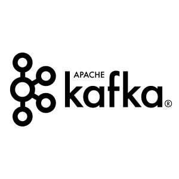
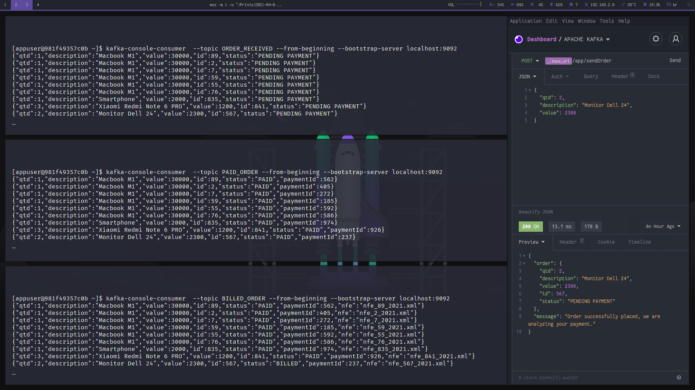

<p align="center">
  
</p>

<br>

## 🚀 Technologies

This project was developed with the following technologies:

- [NodeJS](https://nodejs.org)
- [Apache Kafka](https://kafka.apache.org)

## 💻 Project

This project aims to demonstrate the implementation of 3 microservices interacting with each other.

Note: there is no business rule implemented, it is only for demonstration

<p align="center">
  
</p>

## Getting Started

First, you need to install all project dependencies for each microservices:

```bash
cd order-received
yarn install # OR npm install

cd payment
yarn install # OR npm install

cd revenues
yarn install # OR npm install
```

Now execute docker compose:

```bash
docker-compose up -d
```

Create all topics from Apache Kafka:

```bash
# Enter inside the apache Kafka container
docker exec -it apachekafka_kafka_1 /bin/bash

# Create all topics
kafka-topics --create --topic ORDER_RECEIVED --bootstrap-server localhost:9092
kafka-topics --create --topic PAID_ORDER --bootstrap-server localhost:9092
kafka-topics --create --topic BILLED_ORDER --bootstrap-server localhost:9092
```

Run the development server:

```bash
cd order-received
yarn dev # OR npm run dev

cd payment
yarn dev # OR npm run dev

cd revenues
yarn dev # OR npm run dev
```

Start listening to your topics to check the data:

```bash
# Enter inside the apache Kafka container
docker exec -it apachekafka_kafka_1 /bin/bash

kafka-console-consumer  --topic ORDER_RECEIVED --from-beginning --bootstrap-server localhost:9092
kafka-console-consumer  --topic PAID_ORDER --from-beginning --bootstrap-server localhost:9092
kafka-console-consumer  --topic BILLED_ORDER --from-beginning --bootstrap-server localhost:9092
```

And lastly, make a request to see the magic happen:
> endpoint: http://localhost:3333/app/sendOrder [POST]

```json
{
	"qtd": 1,
	"description": "Name of product",
	"value": 20000
}
```

## :memo: License

This project is under the MIT license. See the file [LICENSE](LICENSE) for more details.

